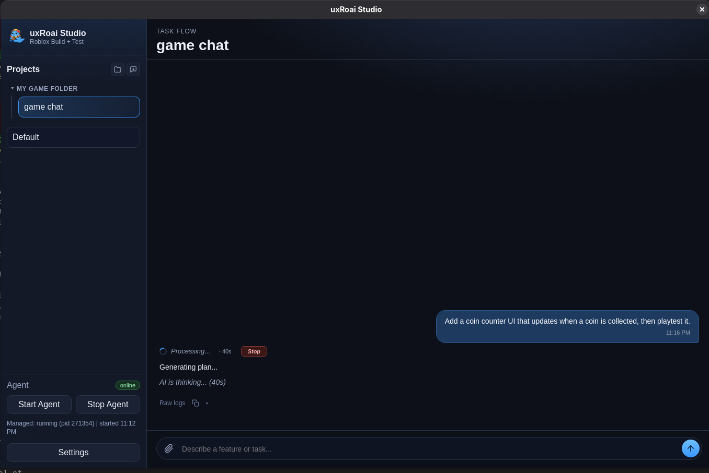
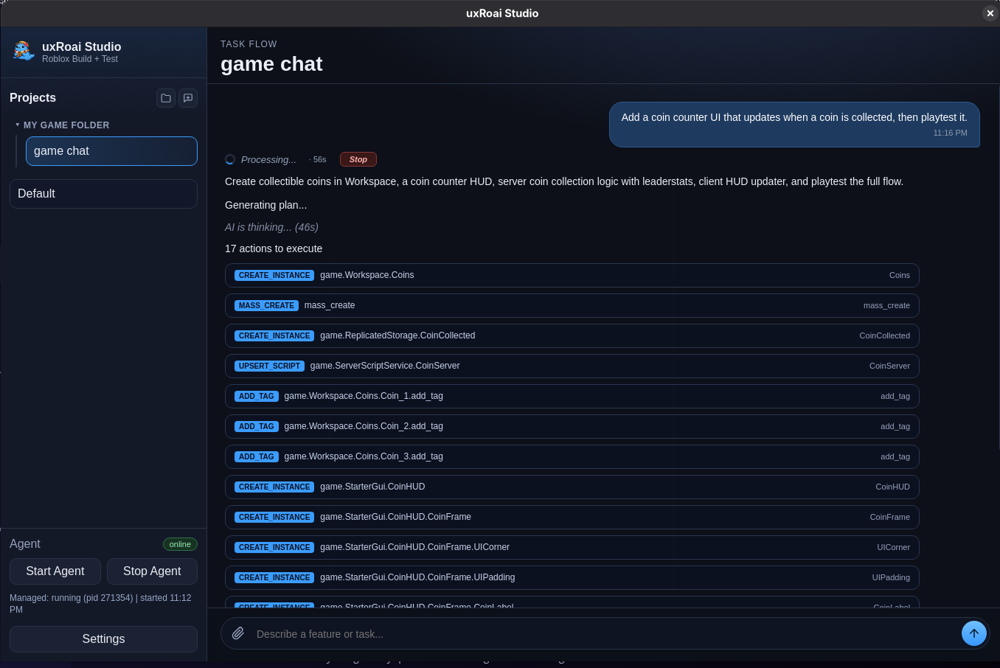
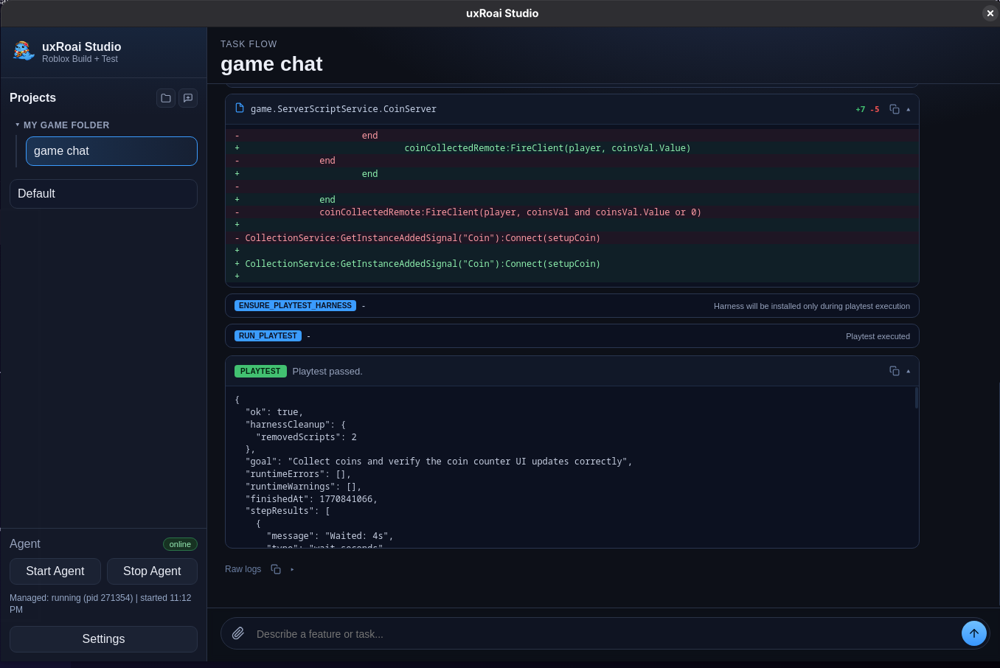

<p align="center">
  
</p>

<h1 align="center">uxRoai</h1>

<p align="center">
  <strong>AI Copilot for Roblox Studio</strong><br>
  Turn natural-language prompts into executable game changes with automatic playtesting.
</p>

<p align="center">
  <a href="#features">Features</a> &bull;
  <a href="#supported-ai-providers">Providers</a> &bull;
  <a href="#architecture">Architecture</a> &bull;
  <a href="#getting-started">Getting Started</a> &bull;
  <a href="#usage">Usage</a> &bull;
  <a href="#action-types">Action Types</a> &bull;
  <a href="#keyboard-shortcuts">Shortcuts</a> &bull;
  <a href="#contributing">Contributing</a> &bull;
  <a href="#license">License</a>
</p>

<p align="center">
  
  
  
  
</p>

---

<p align="center">
  
</p>
<p align="center">
  
</p>
<p align="center">
  
</p>

## What is uxRoai?

uxRoai is an open-source AI copilot that brings natural-language game development to Roblox Studio. Describe what you want in plain English (or Turkish!), and uxRoai will:

1. **Generate** an action plan using AI (Claude, GPT, or Gemini)
2. **Preview** the plan for your approval before execution
3. **Execute** the plan inside Roblox Studio (create instances, write scripts, set properties)
4. **Playtest** automatically with injected harness scripts
5. **Auto-repair** failures using AI-driven diagnostics (configurable retries)

## Features

### Core
- **Natural Language to Game Changes** - Describe features in plain text, get working Roblox code
- **Multi-Provider AI** - Claude (CLI/API), Codex (CLI), OpenAI API, Gemini (CLI/API) — 6 providers
- **Plan Preview** - Review, edit, or reject AI-generated plans before execution
- **20+ Action Types** - Create instances, write/edit scripts, set properties, query the game tree, insert assets, and more
- **Automatic Playtesting** - Test harnesses run in `StudioTestService` with server + client test code, assertions, and GUI interaction
- **Self-Healing Loop** - AI analyzes test failures and retries with fixes (configurable retry count)
- **Safe Spawn System** - Players spawn at a safe staging area during playtests to prevent false failures

### Desktop App
- **Custom Frameless Titlebar** - Native window controls with drag support
- **Native Window Effects** - Mica/Acrylic (Windows), Vibrancy (macOS) with transparency toggle
- **Multi-Chat Threads** - Multiple conversations per project with auto-titling
- **Real-Time Progress** - SSE-based live updates with tool call status hints
- **Visual Diff Cards** - Property before/after, script diffs with syntax highlighting
- **Token Usage Display** - Per-task input/output token count with hover detail
- **Quick Actions** - Retry with Fix, Undo (Ctrl+Z waypoint), Branch from any task
- **Message Queue** - Queue messages while a task is running
- **Model Selector** - Switch AI models from the composer bar
- **Question Mode** - `/ask` prefix for text-only AI answers without executing actions
- **Image Attachments** - Paste, drag-drop, or pick images to include with prompts
- **Persistent Memory** - Per-project memory that carries context across sessions
- **Folder Organization** - Group projects into folders via drag-drop
- **Guided Setup Wizard** - First-time setup flow for new users
- **Context Menus** - Right-click projects and tasks for quick actions
- **Keyboard Shortcuts** - Full keyboard navigation (see below)
- **Bilingual** - English and Turkish UI support

### Studio Plugin
- **Modular Architecture** - 12 focused Lua modules built into a single plugin file
- **Undo Support** - Every change creates a `ChangeHistoryService` waypoint for Ctrl+Z
- **Selection Aware** - Understands your current Studio selection and open script sources
- **Luau Linting** - Bracket matching and block/end validation before script execution
- **GUI Test Hooks** - BindableEvent-based button testing (bypasses Roblox VIM restrictions)
- **Studio Warning Capture** - Captures `LogService` warnings/errors during playtests
- **Creator Store** - Insert assets from the Creator Store via `InsertService:LoadAsset`
- **Context Truncation** - Smart progressive depth trimming to stay within token limits

### Agent
- **Modular Source** - Routes, providers, prompts, and schemas in separate modules
- **MCP Protocol** - `--mcp` flag for stdio mode (works with Cursor, Claude Code, VS Code)
- **Roblox Docs RAG** - API snippets injected into prompts for accurate code generation
- **Long-Polling** - 25s task claim wait reduces Studio plugin polling overhead
- **Batch Progress** - Multiple progress entries in a single HTTP request
- **SSE Event Stream** - Real-time push to Desktop App
- **Async Job System** - Non-blocking AI calls with job polling

## Supported AI Providers

| Provider | Type | Config | Auth |
|----------|------|--------|------|
| **Claude Code** | CLI (subscription) | `code` | `claude` CLI installed + authenticated |
| **Claude API** | HTTP | `api` | `CLAUDE_API_KEY` |
| **Codex CLI** | CLI | `codex` | `codex` CLI installed + authenticated |
| **OpenAI API** | HTTP | `openai-api` | `OPENAI_API_KEY` |
| **Gemini CLI** | CLI | `gemini` | `gemini` CLI installed |
| **Gemini API** | HTTP | `gemini-api` | `GEMINI_API_KEY` |

Switch providers from the Desktop App settings. Each provider family (Claude/Codex/Gemini) has its own model dropdown and configuration fields.

## Architecture

```
 Desktop App (Electron)          Agent (Node.js :41117)          Studio Plugin (Luau)
 ========================       ========================       ========================
 |  Multi-Chat UI        | ---> |  POST /v1/studio/tasks | ---> |  Auto-claim from queue |
 |  Plan Preview         |      |  AI Planning (async)   |      |  Execute actions       |
 |  Task History         | <--- |  SSE /v1/events        | <--- |  Run playtests         |
 |  Settings Panel       |      |  Playtest Generation   |      |  Report results        |
 |  Live Progress        |      |  Token Usage Tracking  |      |  Auto-repair loop      |
 ========================       ========================       ========================
```

**Data Flow:**
1. User enters a prompt in the Desktop App (with optional image attachments)
2. Plugin captures an Explorer snapshot (depth 6, max 4500 nodes) as context
3. Agent sends prompt + context + conversation history to the AI provider
4. AI returns a JSON action plan; agent normalizes and validates it
5. Plan is shown for user approval (approve / edit / reject)
6. Plugin executes approved actions on the game tree
7. If playtesting is requested, harness scripts are injected and `StudioTestService` runs
8. Results flow back through the agent to the Desktop App in real time
9. On failure, AI analyzes issues and generates a repair plan (up to N retries)

## Getting Started

### Prerequisites

- **Node.js** 20+ (22+ recommended)
- **Roblox Studio** (Windows or via Wine on Linux)
- **AI Provider** - at least one of: Claude CLI/API, Codex CLI/OpenAI API, or Gemini CLI/API

### 1. Clone the Repository

```bash
git clone https://github.com/UXPLIMA/uxRoai.git
cd uxRoai
```

### 2. Install the Studio Plugin

```bash
# Build the single-file plugin
cd apps/studio-plugin
node scripts/build-plugin.js

# Option A: Auto-install to Roblox Plugins folder
node scripts/install-plugin.js "<YOUR_ROBLOX_PLUGINS_DIR>"

# Option B: Manually copy dist/uxRoai.plugin.lua to your Plugins folder
```

Then in Roblox Studio:
- Restart Studio and enable the plugin
- Go to **Game Settings > Security > Enable Studio Access to API Services**

### 3. Run the Desktop App

```bash
cd apps/studio-app
npm install
npm start
```

In the app settings:
1. Keep Agent URL as `http://127.0.0.1:41117`
2. Select your AI provider and model
3. Enter API key (if using an API provider)
4. Click **Save Settings**, then **Start Agent**

### Alternative: Run the Agent Standalone

```bash
cd apps/agent
cp .env.example .env
# Edit .env with your provider settings
npm start
```

## Usage

### Example Prompts

```
Add a coin counter UI that updates when a coin is collected, then playtest it.
```

```
Create a shop GUI with 3 items and close button, run click tests on each button.
```

```
Add a rebirth button that resets currency and grants +1 multiplier, test the full flow.
```

```
Build a timed parkour course with 6 platforms, 3 checkpoints, a timer GUI, and a leaderboard.
```

### Question Mode

Prefix with `/ask` to get a text answer without modifying the game:

```
/ask How do I make a part follow the player's mouse?
```

### How It Works

1. Type your prompt in the Desktop App
2. The Studio Plugin auto-claims the task when it's running
3. Review the plan preview and click **Approve & Execute**
4. Watch real-time progress as actions execute
5. Review playtest results and any auto-repairs
6. Use **Ctrl+Z** in Studio to undo any changes

## Action Types

| Action | Description |
|--------|-------------|
| `create_instance` | Create a new Roblox instance with properties |
| `upsert_script` | Create or replace a script |
| `edit_script` | Search-and-replace edits in existing scripts |
| `insert_script_lines` | Insert lines at a specific position |
| `delete_script_lines` | Remove lines by range |
| `set_property` | Set any instance property (supports path refs for Parent, PrimaryPart, etc.) |
| `bulk_set_properties` | Set properties on multiple instances at once |
| `set_relative_property` | Modify properties relative to current value (+, -, *, /, ^) |
| `set_attribute` | Set a custom attribute |
| `add_tag` / `remove_tag` | Manage CollectionService tags |
| `delete_instance` | Remove an instance from the game tree |
| `clone_template_to_variants` | Clone with property variations |
| `smart_duplicate` | Clone with offsets, naming patterns, and cycling |
| `mass_create` | Batch creation of multiple instances |
| `insert_asset` | Insert from Creator Store via asset ID |
| `query_instances` | Search the game tree with filters |
| `get_instance_properties` | Read all properties of an instance |
| `get_class_info` | Discover supported properties of a class |
| `run_code` | Execute sandboxed Luau code |
| `run_playtest` | Run automated playtest scenario |

## Keyboard Shortcuts

| Shortcut | Action |
|----------|--------|
| `Enter` | Send prompt (when textarea focused) |
| `Ctrl+Enter` | Send prompt (global) |
| `Shift+Enter` | New line in prompt |
| `Ctrl+N` | New project |
| `Ctrl+T` | New chat |
| `Ctrl+.` | Stop running task |
| `Ctrl+Shift+S` | Open settings |
| `Alt+Up/Down` | Switch chat/project |
| `Escape` | Close modal |

## Project Structure

```
uxRoai/
  apps/
    agent/                  # Node.js HTTP agent service
      src/
        server.js           # HTTP server, routing (port 41117)
        ai.js               # Core AI call orchestration
        jobs.js             # Async job queue for AI calls
        task-queue.js       # In-memory task queue with SSE events
        utils.js            # JSON parsing, HTTP helpers
        providers/          # AI provider implementations
          dispatcher.js     # Provider selection & routing
          claude-code.js    # Claude CLI provider
          claude-api.js     # Claude HTTP API provider
          codex-cli.js      # Codex CLI provider
          openai-api.js     # OpenAI HTTP API provider
          gemini-cli.js     # Gemini CLI provider
          gemini-api.js     # Gemini HTTP API provider
        prompts/            # System prompt builders
          plan-prompt.js    # Plan generation prompt
          playtest-prompt.js # Playtest scenario prompt
          ask-prompt.js     # Question mode prompt
        routes/             # HTTP route handlers
          plan.js           # /v1/plan endpoints
          tasks.js          # /v1/studio/tasks endpoints
          approval.js       # Plan approval endpoints
          events.js         # SSE /v1/events stream
          playtest.js       # /v1/playtests endpoint
          health.js         # /health endpoint
        schemas/            # Validation & normalization
          normalize-plan.js
          normalize-action.js
          normalize-playtest.js
          validators.js
        data/               # Static data
          roblox-api-index.js  # Roblox API snippets for RAG
    studio-plugin/          # Roblox Studio plugin
      src/
        Main.server.lua           # Plugin entry point
        HarnessTemplates.lua      # Server + client playtest harness
        modules/
          Orchestration.lua       # Task execution & auto-repair loop
          ActionHandlers.lua      # 22 action type handlers
          Playtest.lua            # Playtest execution
          ScriptWriter.lua        # Script creation & editing
          Serialization.lua       # Explorer context serialization
          ClassInspector.lua      # Instance property discovery
          PathResolver.lua        # Game tree path resolution
          ValueDecoder.lua        # Property value encoding/decoding
          UI.lua                  # Plugin widget UI
          Constants.lua           # Shared constants
          Utils.lua               # Utility functions
          I18N.lua                # Plugin i18n strings
      scripts/
        build-plugin.js           # Multi-file build system
        install-plugin.js         # Copies to Roblox Plugins folder
    studio-app/             # Electron desktop app
      main.js               # Main process (window, IPC registration)
      preload.js            # IPC bridge (renderer <-> main)
      src/
        config.js            # Configuration management
        constants.js         # Shared constants (models, providers)
        agent-process.js     # Agent subprocess lifecycle
        window-effects.js    # Native transparency effects
        sse.js               # SSE client for agent events
        ipc/                 # IPC handlers
          config-handlers.js
          task-handlers.js
          project-handlers.js
          history-handlers.js
          image-handlers.js
      renderer/             # Frontend UI
        index.html
        styles.css
        renderer.js          # Entry point
        modules/
          state.js           # Central state & DOM refs
          polling.js          # SSE events, config, settings
          composer.js         # Message input & queue
          task-rendering.js   # Task card rendering
          projects-ui.js      # Sidebar projects & chats
          changes-ui.js       # Diff card rendering
          playtest-ui.js      # Playtest result rendering
          config-ui.js        # Settings panel i18n
          setup-flow.js       # First-time setup wizard
          i18n.js             # EN + TR translations
          tool-hints.js       # Action type labels
          context-menu.js     # Right-click menus
          toast.js            # Toast notifications
          utils.js            # Formatting helpers
  docs/                     # Documentation
  .github/workflows/        # CI/CD (build & release on tag)
```

## Contributing

Contributions are welcome! Here's how to get started:

1. Fork the repository
2. Create a feature branch (`git checkout -b feature/my-feature`)
3. Make your changes
4. Test with the Studio Plugin and Desktop App
5. Commit and push (`git push origin feature/my-feature`)
6. Open a Pull Request

### Development Tips

- After editing plugin source files, rebuild: `cd apps/studio-plugin && node scripts/build-plugin.js`
- The agent runs directly from source — restart `npm run dev` in `studio-app` to pick up changes
- Studio plugin communicates via HTTP to `127.0.0.1:41117`
- Use `Ctrl+Z` in Studio to undo any AI-made changes
- GitHub Actions auto-builds releases when you push a `v*` tag

## License

This project is licensed under the MIT License - see the [LICENSE](LICENSE) file for details.

---

<p align="center">
  Made with &hearts; by <a href="https://github.com/UXPLIMA">UXPLIMA</a>
</p>
